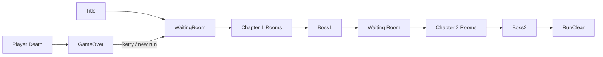
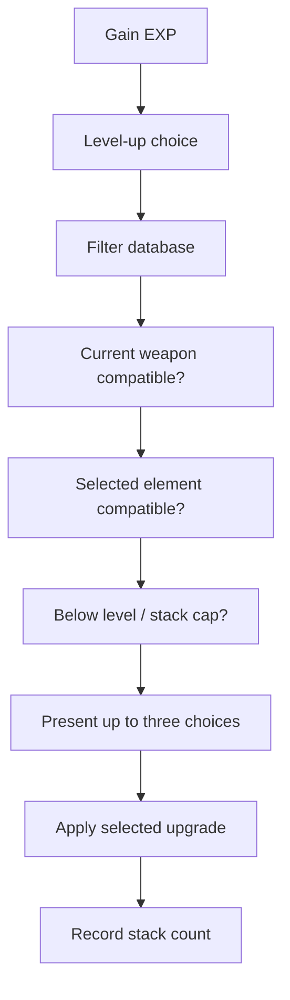
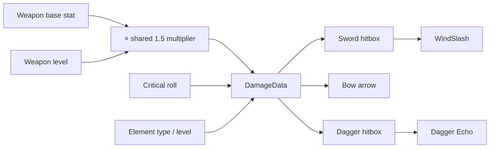
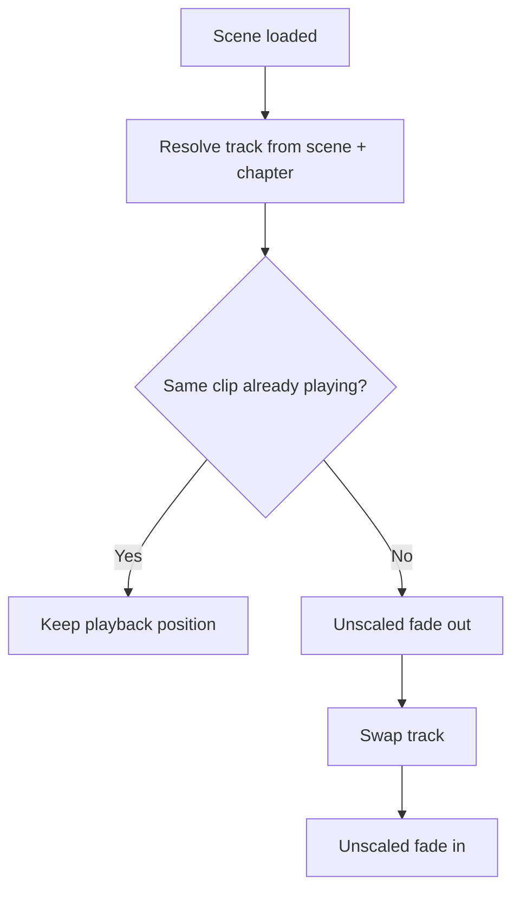

# Architecture

This document summarizes the main runtime flows represented by the public portfolio source. It focuses on ownership, restore order, and the boundaries used to prevent duplicated gameplay effects.

## Run and Scene Flow

`RunManager` is the persistent owner of `RunData`. A snapshot includes player level and experience, health, current weapon and weapon stats, all three weapon levels, critical stats, four element levels, the fixed selected element, chapter state, and upgrade stack counts.

For a normal room transition, the exit flow is:

1. `ExitDoor` accepts the player only while unlocked.
2. `RunManager.SaveCurrentRun()` captures the current gameplay state.
3. `SceneTransition` loads the configured next scene.
4. `RunManager` applies the snapshot to the new scene's player.
5. Upgrade stack metadata and component-local bonuses are restored in a controlled pass.

A genuine new run creates fresh `RunData`; loading the Waiting Room by itself does not reset an existing run.

## Upgrade Flow

`UpgradeManager.CanAcquire()` keeps weapon-specific choices tied to the currently equipped weapon, exposes element-level choices only for the run's selected element, and removes maxed weapon, element, or stack-based upgrades from the pool.

During scene restoration, `RunManager` first restores snapshot-backed values such as health, weapon levels, element levels, and persistent combat stats. `UpgradeManager.RestoreUpgradeStacks()` then restores the recorded stack counts and replays only bonuses owned by newly created scene components. A restore guard prevents those local effects from being applied more than once.

This separates two different responsibilities:

- **Persistent values:** restored from `RunData`.
- **Scene-component effects:** replayed once because the receiving component was recreated with the scene.

## Combat Damage Flow

`Weapon.GetBaseDamage()` combines the weapon stat, the independent weapon-level multiplier, and the shared player damage multiplier. `CreateDamageData()` performs the critical roll and records the active element context. The resolved payload is passed into each delivery mechanism rather than recalculated by the hitbox or projectile.

The primary weapon patterns remain distinct:

- **Sword:** a three-step combo; the third hit can produce WindSlash when Wind is active.
- **Bow:** a non-combo attack that initializes a pooled Arrow with direction, distance, pierce, and the resolved damage payload.
- **Dagger:** a four-step combo with attack-speed and Echo behavior.

WindSlash and Dagger Echo start from damage that already contains shared and weapon-level scaling. They apply only their own secondary multiplier, so common damage is not multiplied twice.

## Room Completion and Fall Death

`RoomController` locks the room's `ExitDoor` and counts active `EnemyRoomMember` instances. Each normal enemy death removes one member from the count; reaching zero unlocks the door. Entering an unlocked door saves the run and starts the normal scene transition. The final boss flow also retains a run-clear guard so a queued door trigger cannot advance after the result state is reached.

The fall zone deliberately does not implement a parallel removal system:

- `PlayerHealth.KillByFall()` continues through the normal player death event, which already drives Game Over UI.
- `EnemyHealth.KillByFall()` continues through the normal enemy death path, preserving drops, death notifications, room counts, and door unlocking.
- Bosses are excluded from the generic enemy fall-kill path.

## Player Visual and Animation Flow

`PlayerAnimationController` keeps locomotion decisions connected to the gameplay Rigidbody and contact state. It loads or reuses the `Resources/PlayerAnimation/PlayerVisual` child, synchronizes facing/color/material/sorting from the gameplay renderer, and switches the runtime controller for Sword, Bow, or Dagger.

Attack animations are requested by successful gameplay attacks rather than chained automatically by the Animator. This keeps Sword's three hits, Bow's single shot, and Dagger's four hits aligned with the input/combo logic. The attack speed parameter affects attack-state playback without accelerating locomotion or hit reactions.

## UI Persistence

`GlobalUI` persists across gameplay scenes and removes duplicate scene-local instances. That lifecycle creates a special case for boss UI: a boss health bar born under a scene-local UI root could be destroyed during deduplication before it binds to the boss.

`BossHealthUI` resolves this by moving to the persistent player-status canvas during initialization while retaining its original scene handle. It holds the boss health reference, refreshes the HP fill each frame, subscribes to the boss death event, and destroys itself when its owner boss scene unloads.

`GameOverUI` follows a separate shared-resource path. A runtime bootstrap loads `Resources/UI/GameOverUI`, prevents duplicates, binds to `PlayerHealth.OnDied`, and reuses the normal run-reset and Waiting Room transition for Retry.

## Audio Flow

`BgmPlayer` selects the chapter-appropriate track, including a chapter-aware Waiting Room choice. Consecutive scenes using the same clip keep the current playback position. Only a real track change performs the fade sequence.

`SfxPlayer` centralizes one-shot playback through stable SFX identifiers, per-entry volume scales, and optional minimum intervals. `GameSettings` stores SFX and BGM volumes under separate PlayerPrefs keys, migrates the legacy master-volume value to SFX once, and keeps `AudioListener.volume` at 1 so the two channels remain independent.

## Object Pooling

The shared `ObjectPool` owns created instances, prewarms a configured amount, expands when exhausted, and rejects returns from the wrong pool or duplicate returns. Transform state is normalized on return. Pooled projectiles such as Arrow reset per-shot state when disabled so direction, pierced targets, travel distance, and visual facing do not leak into the next use.

## Editor and Authoring Tools

The public source includes project-specific Editor tools used during production rather than runtime systems. Their responsibilities include:

- combat-room generation and committed environment production;
- enemy authoring and Chapter 2 reference repair;
- upgrade asset registration and balance validation;
- player Sword/Bow/Dagger animation setup;
- Waiting Room weapon-selection setup;
- run-balance and production-grid utilities.

These tools use Unity's Editor APIs to make repeatable asset and scene changes while keeping runtime code focused on gameplay.
