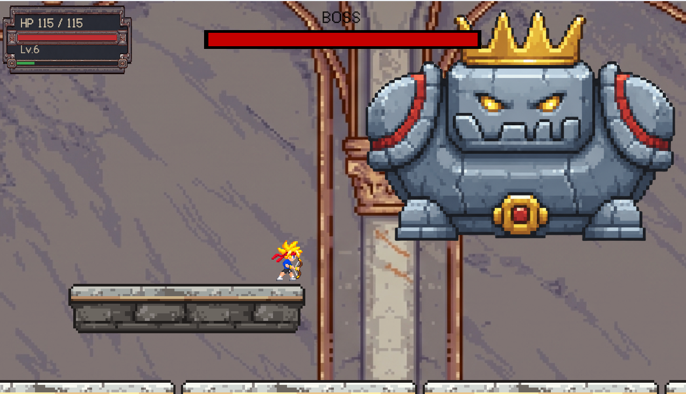
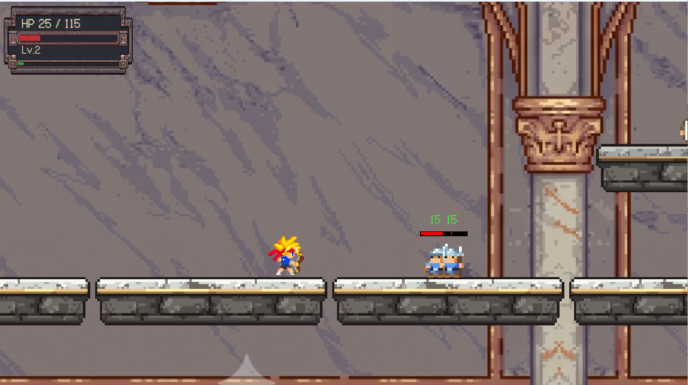
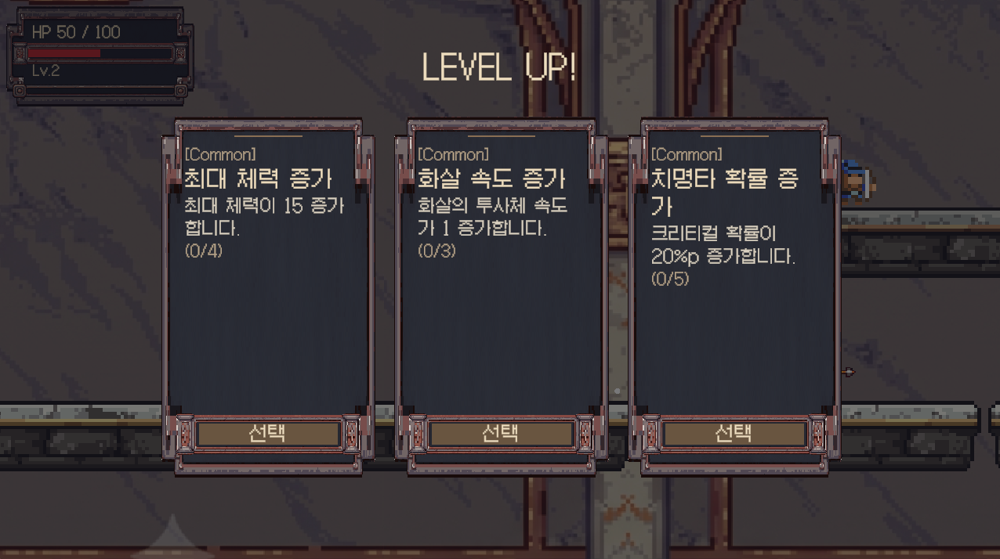
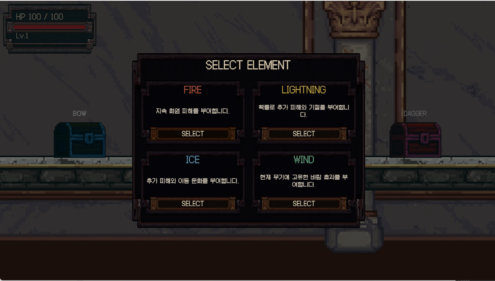

# Unity 2D Action Roguelite

[English README](README.md)



Unity로 개발한 2D 액션 로그라이트 개인 프로젝트입니다.

3종의 무기, 4종의 원소, Room 단위 진행, 그리고 한 번의 Run 동안 유지되는 성장 시스템을 중심으로 구성했습니다.

> 이 저장소는 코드 중심의 포트폴리오 공개 버전입니다.  
> 재배포 제한이 있는 외부 아트, 오디오, 폰트 파일은 포함하지 않았습니다.

## 프로젝트 개요

| | |
|---|---|
| 엔진 | Unity 6000.3.11f1 (Unity 6) |
| 언어 | C# |
| 렌더링 | URP 2D |
| 플랫폼 | Windows x86_64 |
| 장르 | 2D Action Roguelite |
| 개발 형태 | 개인 프로젝트 |

## 게임 구성

한 번의 Run은 두 개의 Chapter로 구성됩니다.

각 Chapter에는 3개의 일반 전투 Room과 1개의 Boss Room이 있습니다.  
Room 안의 적을 모두 처치하면 출구가 열리고 다음 Room으로 이동할 수 있습니다.

플레이어는 세 가지 무기를 사용할 수 있습니다.

- Sword — 3연속 근접 공격
- Bow — 단발형 원거리 공격
- Dagger — 빠른 4연속 공격과 추가 Echo 효과

Run 시작 시 네 가지 원소 중 하나를 선택합니다.

- Fire
- Lightning
- Ice
- Wind

선택한 원소는 해당 Run 동안 고정되며, 장착한 무기와 함께 성장할 수 있습니다.

적을 처치하면 경험치를 획득하고, 레벨업 시 3개의 업그레이드 중 하나를 선택합니다.

## 주요 기능

- Sword, Bow, Dagger 3종 무기와 서로 다른 전투 방식
- Fire, Lightning, Ice, Wind 4종 원소 성장
- 현재 무기와 선택한 원소에 맞는 업그레이드
- 무기별 독립 레벨 시스템
- 일반 Room과 Boss Room으로 구성된 2개 Chapter
- Scene 전환 이후에도 유지되는 Run 상태
- Game Over / Retry / Run Clear 흐름
- Boss HP UI
- BGM / SFX 독립 볼륨 설정
- Projectile Object Pooling
- 개발 과정에서 사용한 Unity Editor 전용 도구

## 기술 구현

### Scene 간 Run 상태 유지

`RunManager`와 `RunData`를 이용해 Scene이 바뀌어도 현재 Run의 상태를 유지하도록 구현했습니다.

유지되는 정보는 다음과 같습니다.

- Player HP와 EXP
- 현재 장착 무기
- Sword / Bow / Dagger 레벨
- 선택한 Element와 Element 레벨
- Player 능력치
- 획득한 Upgrade Stack

개발 중 Scene을 이동할 때 일부 Upgrade가 다시 적용되어 능력치가 중복 증가하는 문제가 있었습니다.

이를 해결하기 위해 저장된 능력치는 먼저 Snapshot 값으로 복원하고, Scene의 Component에 다시 생성해야 하는 효과만 별도로 적용하도록 Restore 과정을 나눴습니다.

이 구조를 통해 Scene이 바뀌어도 같은 Upgrade가 중복 적용되지 않도록 했습니다.

### 무기와 Damage 구조

Sword, Bow, Dagger는 공통 `Weapon`의 기본 Damage 계산을 사용합니다.

공통 Damage 배율과 Weapon Level 배율은 한 번만 계산한 뒤 각 무기의 공격 로직으로 전달합니다.

공격 시 `DamageData`에 최종 Damage, Critical 여부, Element 정보를 담아 대상에게 전달하도록 구성했습니다.

WindSlash와 Dagger Echo 같은 추가 공격은 이미 계산된 Damage 값을 기준으로 자신의 배율만 적용하여 공통 배율이 다시 적용되지 않도록 했습니다.

### 무기별 Animation

세 무기는 서로 다른 공격 Animation을 사용하지만, Player Animator 전체를 무기마다 따로 만들지는 않았습니다.

이동, 점프, 착지, 피격, 기본 Attack State 구조는 하나의 Animator에서 공유합니다.

무기별 Animation Clip은 Animator Override Controller를 통해 교체하도록 구성했습니다.

이를 통해 Player Animation 로직은 한 곳에서 관리하면서 Sword, Bow, Dagger마다 다른 Animation을 사용할 수 있도록 했습니다.

### Room 진행 구조

`RoomController`가 `EnemyRoomMember`를 통해 현재 Room의 Enemy를 추적합니다.

마지막 Enemy가 사망하면 `ExitDoor`가 Unlock됩니다.

개발 중 Enemy가 맵 아래로 떨어진 뒤 정상적인 사망 처리를 거치지 않아, 더 이상 공격할 수 없는데도 살아 있는 것으로 판정되어 출구가 열리지 않는 문제가 있었습니다.

이를 해결하기 위해 낙사한 Enemy도 기존 `EnemyHealth` 사망 흐름을 그대로 사용하도록 변경했습니다.

Player 낙사 역시 별도의 사망 시스템을 만들지 않고 기존 `PlayerHealth`의 사망 Event를 사용해 Game Over와 Retry 흐름을 재사용했습니다.

### Boss UI와 Persistent UI

`GlobalUI`는 Gameplay Scene이 바뀌어도 유지됩니다.

이 구조 때문에 Boss Room에 진입했을 때 Scene의 중복 `GlobalUI`가 제거되면서 그 하위에 있던 Boss HP UI도 함께 사라지는 문제가 있었습니다.

이를 해결하기 위해 `BossHealthUI`를 Persistent Canvas 아래로 이동시키고, 해당 UI가 어떤 Boss Scene에 속하는지는 별도로 유지하도록 했습니다.

Boss 전투 중에는 HP Fill을 갱신하고, 해당 Boss Scene이 Unload되면 UI도 함께 제거됩니다.

### Scene 전환과 BGM

`BgmPlayer` 역시 Scene 사이에서 유지됩니다.

연속된 두 Scene이 같은 BGM Track을 사용할 경우 처음부터 다시 재생하지 않고 기존 재생 위치를 그대로 유지합니다.

실제로 Track이 변경될 때만 Fade Out / Fade In을 실행합니다.

SFX와 BGM의 볼륨은 각각 독립적으로 저장됩니다.

프로젝트 구조에 대한 더 자세한 설명은 아래 문서에 정리했습니다.

[Architecture Documentation](Docs/ARCHITECTURE.md)

## 개발 중 해결한 문제

### Scene 이동 후 Upgrade 수치가 중복 증가하는 문제

문제:  
새로운 Room으로 이동할 때 일부 Upgrade가 다시 적용되어 능력치가 계속 증가했습니다.

원인:  
저장된 능력치와 Upgrade 효과를 모두 Scene 진입 시 다시 복원하고 있었습니다.

해결:  
Snapshot으로 저장되는 값과 Scene Component에 다시 적용해야 하는 효과를 분리했습니다.

결과:  
Scene을 이동해도 Player의 실제 능력치가 중복 증가하지 않고 동일하게 유지됩니다.

---

### Boss HP Bar가 사라지는 문제

문제:  
Boss Room에 진입하면 Boss HP Bar가 사라지는 경우가 있었습니다.

원인:  
이미 Persistent 상태인 `GlobalUI`가 존재해 Scene의 중복 UI가 삭제되면서, 그 아래에 있던 Boss UI도 함께 제거되고 있었습니다.

해결:  
중복 UI가 제거되기 전에 Boss UI를 Persistent Canvas 아래로 이동시키고, 원래 Boss Scene 정보를 별도로 유지하도록 했습니다.

결과:  
두 Boss Room에서 Boss HP Bar가 정상적으로 표시되고, Boss Scene 종료 시 UI도 함께 정리됩니다.

---

### 낙하한 Enemy 때문에 Room을 클리어할 수 없는 문제

문제:  
Enemy가 맵 아래로 떨어지면 더 이상 공격할 수 없지만 살아 있는 것으로 판정되어 출구가 열리지 않았습니다.

원인:  
낙사한 Enemy가 기존 `EnemyHealth` 사망 흐름을 거치지 않고 있었습니다.

해결:  
Fall Kill Zone에서도 일반 전투와 동일한 `EnemyHealth` 사망 로직을 사용하도록 변경했습니다.

결과:  
Enemy Drop, Room Enemy Count, `ExitDoor` Unlock이 모두 기존 시스템을 그대로 사용하게 되었습니다.

---

### 3종 무기의 Animation 구성

문제:  
Sword, Bow, Dagger가 서로 다른 공격 Animation을 사용해야 했지만, 무기마다 Player Animator 전체를 복제하면 관리가 복잡해질 수 있었습니다.

해결:  
공통 Animator 구조를 유지하고 무기별 Animation Clip만 Animator Override Controller로 교체하도록 구성했습니다.

결과:  
이동과 점프 등의 공통 로직은 하나로 유지하면서 각 무기마다 다른 공격 Animation을 사용할 수 있게 되었습니다.

## 프로젝트 구조

```text
Assets/
├─ Scripts/             # Runtime Gameplay Code
├─ Editor/              # 프로젝트 전용 Unity Editor Tool
└─ Data/
   └─ Upgrades/         # UpgradeData Asset 및 Database

Packages/               # Unity Package Manifest
Docs/                   # Architecture 문서 및 미디어
```

Script 영역
폴더	역할
Audio	BGM, SFX, UI Audio, 볼륨 설정
Boss	Boss Health, Attack, Projectile 및 Boss 관련 로직
Camera	Player Follow Camera
Combat	공통 Damage Data, Critical 및 Combat 처리
Core	공통 Runtime 구조와 Object Pool
Enemy	Enemy AI, Health, Attack, Room Tracking, Fall 처리
Item	Experience Gem 및 Collectible
Player	Movement, Health, Status, Animation, Player State
Run	Scene 간 Run 상태 유지와 Chapter 진행
UI	HUD, Pause, Level Up, Element, Status, Boss, Result UI
Upgrade	Upgrade Filtering, 적용, Stack, Restore
Utility	공통 Helper Component
Weapon	Sword, Bow, Dagger, Projectile, Hitbox, 추가 공격

## 조작법
입력	동작
A / D 또는 방향키	이동
Space	점프 / 상호작용
Z	공격
S	Status 열기 / 닫기
Esc	Pause / Back
## 개발 환경
Unity 6000.3.11f1
C#
Universal Render Pipeline 2D
Unity Input System
Windows Standalone x86_64
## 개발 방식

프로젝트 일부 작업에서는 AI 개발 도구를 활용했습니다.

주로 Code 초안 작성, 반복적인 Unity Editor Tool 제작, 프로젝트 전반의 구조와 참조 검증 작업 속도를 높이는 데 사용했습니다.

필요한 기능과 시스템 제약 조건을 먼저 정의한 뒤, 생성된 Code를 실제 프로젝트 구조에 맞게 검토하고 수정하여 적용했습니다.

최종 Gameplay 동작과 기술적인 결정은 직접 테스트와 검증을 통해 확인했습니다.

## Build 상태
Windows Release Build: 성공
Runtime Compile Error: 0
Editor Compile Error: 0
최종 Audit 기준 Missing Script: 0
전체 Play Mode Run-through: 완료
## Screenshots / Video

### Gameplay



### Upgrade 선택



### 원소 선택



플레이 영상은 추후 추가할 예정입니다.

## Third-party Asset

프로젝트 개발 과정에서 외부 Art, Audio, Font Asset을 사용했습니다.

해당 Binary 파일은 재배포 제한을 고려해 Public Repository에 포함하지 않았습니다.

License와 Attribution에 대한 자세한 내용은 아래 문서에서 확인할 수 있습니다.

[THIRD_PARTY_NOTICES.md](THIRD_PARTY_NOTICES.md)

## Repository 안내

이 Repository는 포트폴리오와 코드 리뷰를 위한 공개 버전입니다.

일부 Third-party Asset은 공개 저장소에 재배포하지 않았기 때문에, 이 Repository만 Clone하여 원본 Unity 프로젝트를 그대로 실행할 수는 없습니다.

대신 직접 작성한 C# Gameplay Code, Unity Editor Tool, Upgrade Data, Package 설정, 기술 문서를 중심으로 공개하고 있습니다.